# Markdown & Diagrams Guide

Neovim에서 Markdown 작성 및 Mermaid, PlantUML 다이어그램 프리뷰 완벽 가이드입니다.

## 지원되는 기능

### ✅ Markdown
- **Neovim 내부 렌더링**: Headers, 코드 블록, 테이블, 체크박스, 링크
- **브라우저 프리뷰**: 실시간 동기화, GitHub 스타일
- **LaTeX**: 수학 수식 렌더링
- **Callouts**: GitHub/Obsidian 스타일 알림 블록
- **TOC**: 자동 목차 생성
- **Table Mode**: 마크다운 테이블 자동 정렬

### ✅ Mermaid
- Flowcharts
- Sequence diagrams
- Gantt charts
- Class diagrams
- State diagrams
- ER diagrams
- Git graphs

### ✅ PlantUML
- UML diagrams
- Sequence diagrams
- Use case diagrams
- Class diagrams
- Activity diagrams
- Component diagrams
- State diagrams

---

## 설치 요구사항

### 1. PlantUML 설치

#### macOS
```bash
# Java 설치 (PlantUML 필요)
brew install openjdk

# PlantUML 설치
brew install plantuml

# 확인
plantuml -version
```

#### Linux (Ubuntu/Debian)
```bash
# Java 설치
sudo apt install default-jre

# PlantUML 설치
sudo apt install plantuml

# 또는 최신 버전 다운로드
wget https://github.com/plantuml/plantuml/releases/download/v1.2024.3/plantuml-1.2024.3.jar
sudo mv plantuml-1.2024.3.jar /usr/local/bin/plantuml.jar

# 실행 스크립트 생성
echo '#!/bin/bash
java -jar /usr/local/bin/plantuml.jar "$@"' | sudo tee /usr/local/bin/plantuml
sudo chmod +x /usr/local/bin/plantuml
```

#### jar 파일 직접 사용
```bash
# PlantUML jar 다운로드
wget https://github.com/plantuml/plantuml/releases/latest/download/plantuml.jar

# 경로 지정 (Neovim 설정에서)
# lua/plugins/markdown.lua에서:
-- vim.g['plantuml_previewer#plantuml_jar_path'] = '/path/to/plantuml.jar'
```

---

### 2. Graphviz 설치 (PlantUML 의존성)

```bash
# macOS
brew install graphviz

# Linux
sudo apt install graphviz
```

---

## 키바인딩

### Markdown Preview (Mermaid 지원)
| 키 | 기능 |
|-----|------|
| `<Space>mp` | Markdown 브라우저 프리뷰 열기 |
| `<Space>ms` | 프리뷰 중지 |
| `<Space>mt` | 프리뷰 토글 |

### PlantUML
| 키 | 기능 |
|-----|------|
| `<Space>pu` | PlantUML 프리뷰 열기 |
| `<Space>ps` | PlantUML 이미지 저장 |
| `<Space>pt` | PlantUML 토글 |

### Table Mode
| 키 | 기능 |
|-----|------|
| `<Space>tm` | 테이블 모드 토글 |

### TOC (Table of Contents)
| 키 | 기능 |
|-----|------|
| `<Space>mT` | 목차 생성/업데이트 |

---

## 사용 예시

### 1. Mermaid 다이어그램

**Flowchart**:
````markdown
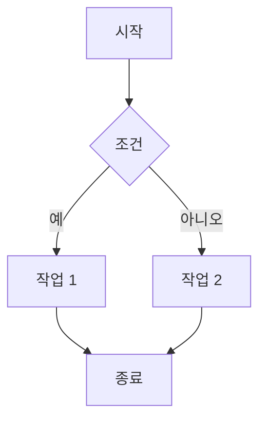
````

**Sequence Diagram**:
````markdown
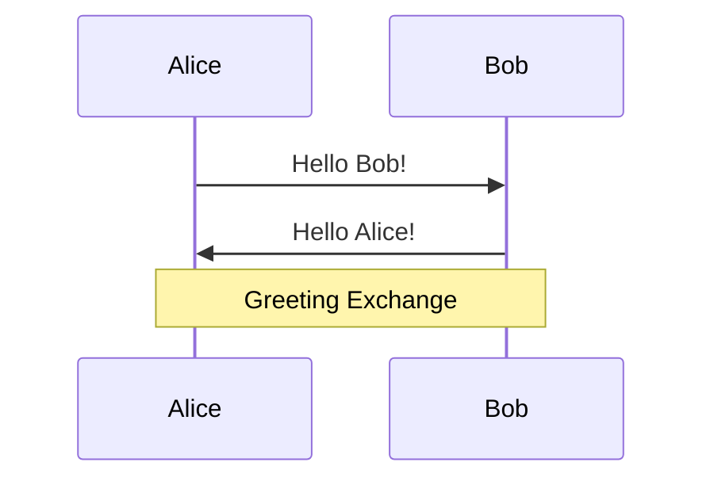
````

**Gantt Chart**:
````markdown
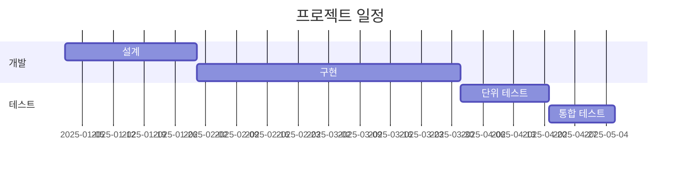
````

**Class Diagram**:
````markdown
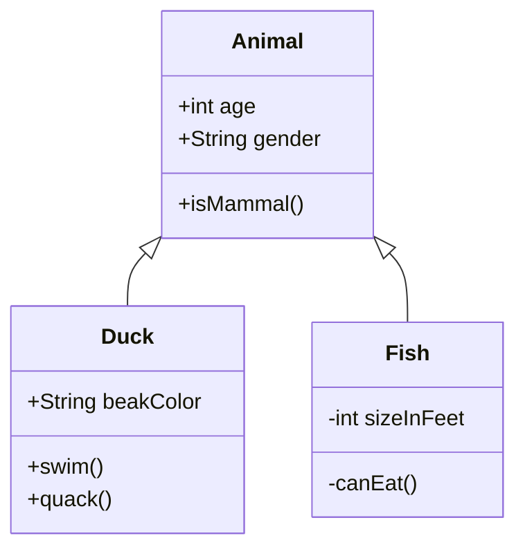
````

---

### 2. PlantUML 다이어그램

**파일 생성**: `diagram.puml` 또는 `diagram.plantuml`

**Sequence Diagram**:
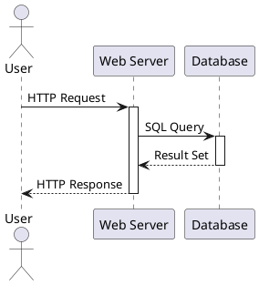

**Class Diagram**:
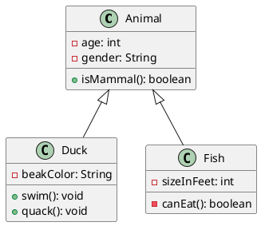

**Use Case Diagram**:
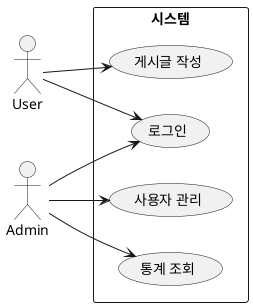

**Activity Diagram**:
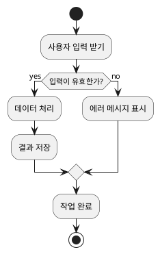

---

### 3. Markdown 작성 팁

#### Callouts (GitHub/Obsidian 스타일)

```markdown
> [!NOTE]
> 유용한 정보입니다.

> [!TIP]
> 도움이 되는 팁입니다!

> [!IMPORTANT]
> 중요한 정보입니다.

> [!WARNING]
> 주의가 필요합니다.

> [!CAUTION]
> 위험할 수 있습니다.
```

#### 체크박스

```markdown
- [ ] 할 일 1
- [x] 완료된 작업
- [-] 진행 중
```

#### 테이블 (Table Mode 사용)

1. `<Space>tm` - Table Mode 활성화
2. `|` 입력 시작:
```markdown
| Header 1 | Header 2 |
|----------|----------|
| Cell 1   | Cell 2   |
```
3. Table Mode가 자동으로 정렬

#### LaTeX 수식

```markdown
인라인: $E = mc^2$

블록:
$$
\int_{a}^{b} f(x) dx = F(b) - F(a)
$$
```

---

## 워크플로우

### Markdown 작성 워크플로우

1. **Markdown 파일 생성**: `nvim README.md`
2. **실시간 렌더링 확인**: Normal mode에서 자동 렌더링
3. **편집**: Insert mode로 전환하면 원본 보임
4. **브라우저 프리뷰**: `<Space>mp` (Mermaid 다이어그램 포함)

### PlantUML 워크플로우

1. **PlantUML 파일 생성**: `nvim diagram.puml`
2. **다이어그램 작성**: UML 문법으로 작성
3. **프리뷰**: `<Space>pu` (브라우저 자동 열림)
4. **저장 시 자동 갱신**: 파일 저장하면 프리뷰 자동 업데이트
5. **이미지 저장**: `<Space>ps` (PNG 파일로 저장)

### 혼합 워크플로우

**Markdown 안에 다이어그램 포함**:
````markdown
# 프로젝트 문서

## 시스템 아키텍처

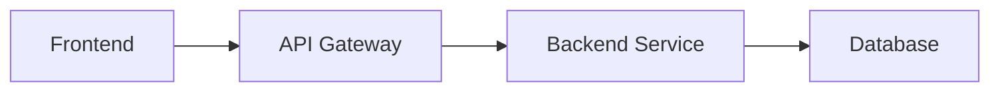

## 상세 시퀀스

상세한 시퀀스는 [sequence.puml](./sequence.puml) 참조
````

---

## 문제 해결

### PlantUML: "Cannot find plantuml"

**원인**: PlantUML이 PATH에 없음

**해결**:
```bash
# 설치 확인
which plantuml

# 설치되지 않았다면
brew install plantuml  # macOS
sudo apt install plantuml  # Linux
```

---

### PlantUML: "Cannot find Graphviz"

**원인**: Graphviz 미설치

**해결**:
```bash
brew install graphviz  # macOS
sudo apt install graphviz  # Linux
```

---

### Markdown Preview: 브라우저가 열리지 않음

**해결**:
```bash
# 플러그인 재설치
nvim
:Lazy sync
:call mkdp#util#install()
```

---

### Mermaid가 렌더링되지 않음

**확인**:
1. 마크다운 파일에서 `<Space>mp` 실행
2. 브라우저에서 확인 (Neovim 내부 렌더링은 Mermaid 미지원)

---

### PlantUML 프리뷰가 업데이트되지 않음

**해결**:
```bash
# 브라우저 새로고침
# 또는 프리뷰 재시작
<Space>ps  # 중지
<Space>pu  # 다시 열기
```

---

## 고급 기능

### PlantUML 테마 변경

```plantuml
@startuml
!theme blueprint
' 또는: amiga, aws-orange, black-knight, bluegray 등

class Example {
  + method()
}
@enduml
```

사용 가능한 테마: https://plantuml.com/theme

---

### Mermaid 테마 설정

````markdown
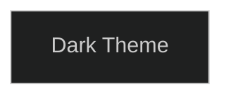
````

테마 옵션: `default`, `dark`, `forest`, `neutral`

---

### 복잡한 PlantUML 다이어그램

**Deployment Diagram**:
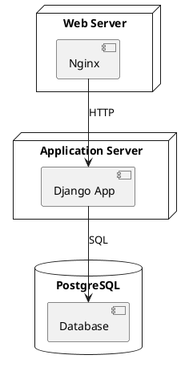

**Component Diagram**:
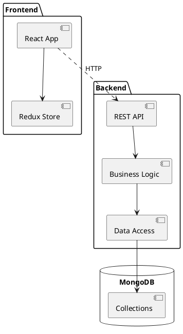

---

## 참고 자료

### Mermaid
- 공식 문서: https://mermaid.js.org/
- Live Editor: https://mermaid.live/
- 예제: https://mermaid.js.org/syntax/examples.html

### PlantUML
- 공식 사이트: https://plantuml.com/
- 온라인 에디터: http://www.plantuml.com/plantuml/
- 가이드: https://plantuml.com/guide

### Markdown
- CommonMark: https://commonmark.org/
- GitHub Flavored Markdown: https://github.github.com/gfm/

---

## 키바인딩 요약

| 기능 | 키 | 설명 |
|------|-----|------|
| **Markdown Preview** | `<Space>mp` | 브라우저 프리뷰 열기 (Mermaid 포함) |
| | `<Space>ms` | 프리뷰 중지 |
| | `<Space>mt` | 프리뷰 토글 |
| **PlantUML** | `<Space>pu` | PlantUML 프리뷰 열기 |
| | `<Space>ps` | PNG 저장 |
| | `<Space>pt` | 프리뷰 토글 |
| **Table Mode** | `<Space>tm` | 테이블 자동 정렬 모드 |
| **TOC** | `<Space>mT` | 목차 생성 |

---

**축하합니다! 🎉** 이제 Neovim에서 Markdown, Mermaid, PlantUML을 모두 사용할 수 있습니다!

다음 단계:
1. Markdown 파일 열기: `nvim README.md`
2. Mermaid 다이어그램 추가
3. `<Space>mp`로 브라우저 프리뷰 확인
4. PlantUML 파일 생성: `nvim diagram.puml`
5. `<Space>pu`로 실시간 프리뷰
